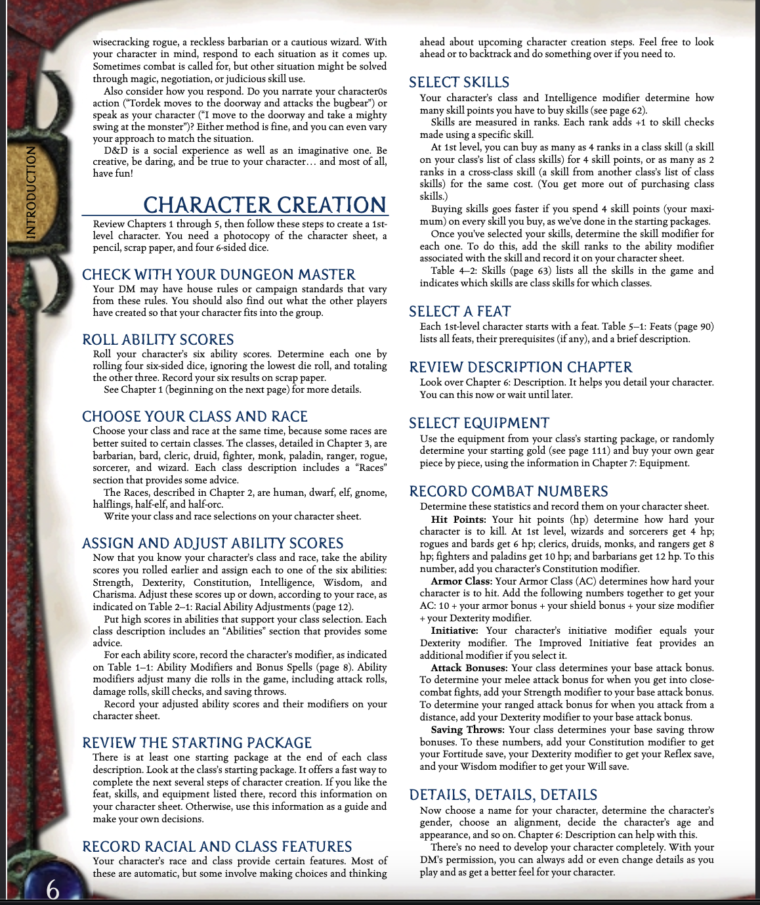

## Flamethrower - D&D 3.5E Database/Character Creator TUI

For running, download the

> dnd35.db

download a release that suits your os.

Have fun!

### Flow

WIP

embed the views.svg inside the src/views

### Things To Do

Well, just follow this:

We have a functional class selection, soo. Rest needs to be done. I am ultra mega super uber bored, may well look into this. 